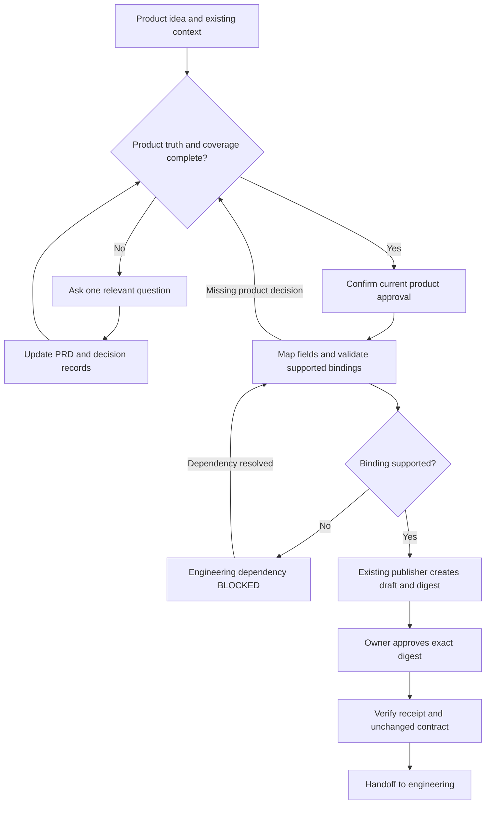

# Accepted PMOS workflow and implementation boundaries

PMOS owns elicitation and product meaning. The existing external publisher owns
canonical serialization and approval receipts; the engineering system owns
compilation/build execution. Source-code or document location alone does not
transfer product authority. No second publisher or engineering runner is added.

## Intake and artifact contract

- The strict engineering path already follows from the owner-approved architecture;
  it needs no new choice between bypassing intake and preserving intent. Preserve
  an explicitly requested ordinary prototype path, but never label its incomplete
  draft as approved for engineering. No TBD, skipped critical decision, inferred
  identity or autonomous task-description shortcut enters a verified handoff.
- Reuse existing supplied answers. Ask one unresolved question at a time in a
  dependency-aware order: problem/user/hypothesis; intended outcome and measures;
  included journeys and scope; failure/permission/data boundaries; acceptance and
  non-functional constraints; risks, gates and accountable approvals.
- Replace fixed question-count completion with a reviewable coverage check. Every
  requested behavior must map to an FR and acceptance intent; every required
  publisher field must be supplied, explicitly owner-decided, or OPEN. An OPEN
  required decision blocks approval/publication and has no invented default.
- The PRD remains the product-specific source of truth under `prds/` in the target
  product project. Use stable question/decision/requirement IDs and preserve owner
  wording. Root `DECISIONS.md` is the existing shared decision-log path; context
  memory must point to it and reconcile legacy `context/DECISIONS.md` without
  silent deletion or overwriting. Do not move an active planner register here.
- Route to existing specialist skills only for actual missing work. For example,
  metrics → north-star-designer; acceptance → prd-to-eval; failure policy →
  guardrail-designer. Golden-dataset-builder requires real reviewed examples:
  never invent human verdicts or observed outputs for a new product.
- Product approval and exact-digest contract approval remain separate. Publisher
  validation errors return bounded questions; they never authorize guessed values.
  Changing approved meaning or bytes requires renewed approval.

## Engineering boundary

- Current release gates explicitly reference acceptance criteria. The current
  example and tests must agree; frozen legacy fixtures remain immutable.
- `health` is the frozen template's registered action, not a claim that every
  product must be a health demo. Existing trusted-test/template/bundle routes may
  be documented only to the extent verified against the already pinned interface.
  Unsupported bindings return BLOCKED and remain an engineering dependency.
- A clean-user guide and optional handoff preflight must name the existing
  publisher prerequisite and compatibility pin. Do not make ordinary PM skill
  installation require or automatically install the engineering system.
- Keep the existing immutable reviewed dependency while compatibility with a
  merged engineering revision is unresolved. A pinned review commit does not
  itself break CI when PMOS merges. Do not merge or repin PEOS from this thread.
- Existing restricted full handoff probes remain excluded from execution. New
  authoring tests do not replace those probes or claim their security coverage.

## Proof and open decisions

The acceptance goal remains owner-approved requirements producing software that
does what was approved, with checkable evidence (PMOS issue #56). Compiler first-
pass acceptance is a leading measure, not a replacement outcome North Star.
No new numerical target or product-specific threshold is adopted automatically.

Record separately: code/instructions implemented; static and ordinary black-box
checks passed; supervised model behavior, native Claude execution and actual
fresh product delivery still unverified unless such runs actually occur.
The historical task-store demonstration proves bounded feasibility only.

External coordination remains open for the active planner register's canonical
location and for a merged compatible engineering dependency. Owner-specific
product decisions remain OPEN, and cannot block unrelated PMOS implementation.
